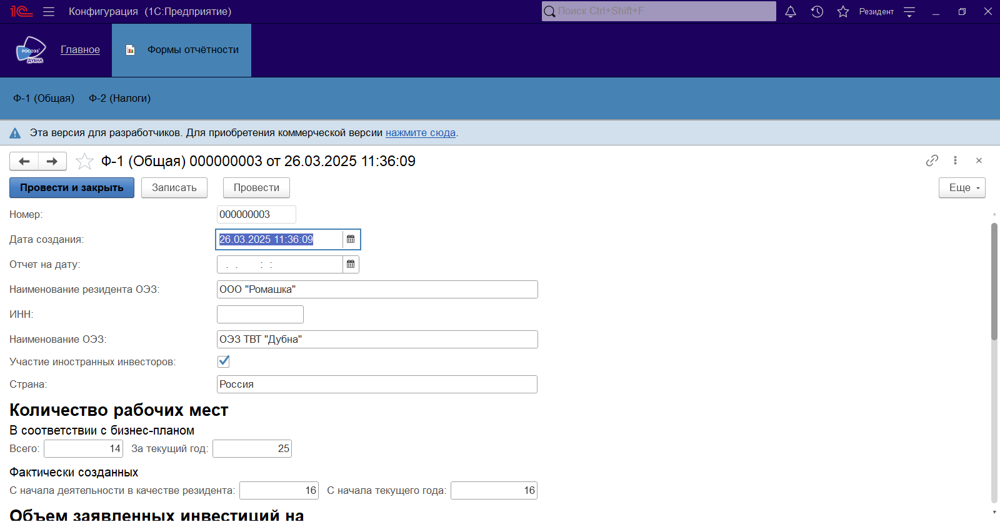

# Reporting_by_SEZ_residents
Особые экономические зоны (ОЭЗ) являются ключевым инструментом стимулирования экономического развития регионов и привлечения инвестиций, требующим постоянного мониторинга и оценки эффективности. Создание и развитие ОЭЗ направлено на формирование точек роста региональной экономики через предоставление специальных условий хозяйственной деятельности. Эффективное функционирование ОЭЗ напрямую зависит от своевременного и достоверного сбора данных отчетности от резидентов. Актуальность данной выпускной квалификационной работы обусловлена необходимостью совершенствования процесса сбора, хранения и обработки этих данных в ОЭЗ.
В рамках работы планируется разработка системы, которая позволит резидентам вводить показатели отчетности, а сотрудникам управляющей компании — отслеживать динамику данных, автоматизировать процесс верификации и формировать необходимые отчеты, включая единый ежеквартальный отчет.

## Описание процесса работы в системе 
Выполним вход в систему под пользователем «Резидент». После входа в систему будет отображена главная страница пользователя «Резидент».

Для заполнения отчёта необходимо перейти в раздел «Формы отчётности», выбрать требуемую форму: «Ф-1 (Общая)» или «Ф-2 (Налоги)». В этом разделе можно посмотреть ранее отправленные отчеты, создать новый отчет, загрузить отчет из файла Excel или выгрузить текущую отчетность в файл Excel.
».png "Главная страница")

Рассмотрим создание нового отчёта. Нажимаем «Создать» и заполняем данные. При нажатии на кнопку «Провести» или «Провести и закрыть» изменения будут сохранены и станут доступны для просмотра сотруднику управляющей компании, при этом редактирование станет невозможным. Если введенные данные требуют корректировки или уточнения, необходимо нажать кнопку «Записать». В этом случае данные будут сохранены, но останутся невидимыми для сотрудника управляющей компании до тех пор, пока отчёт не будет проведён. Также следует отметить, что резидент не может удалять проведённые отчёты.

