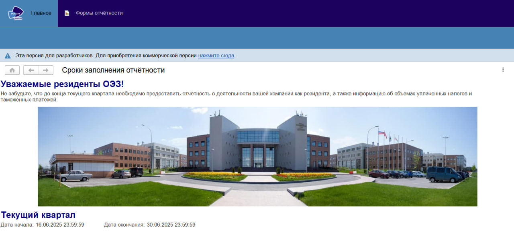
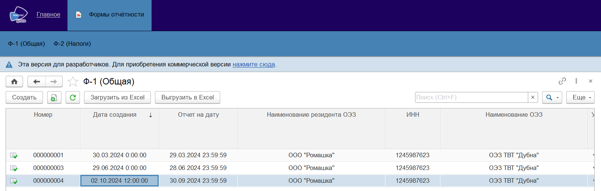
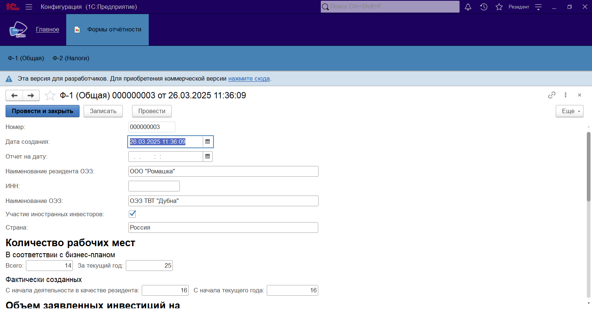
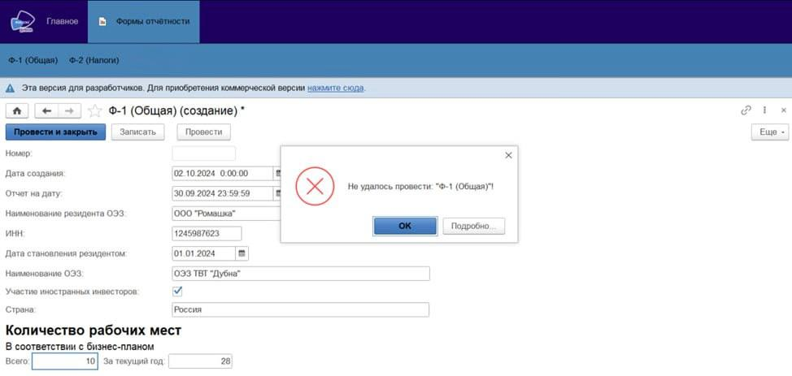
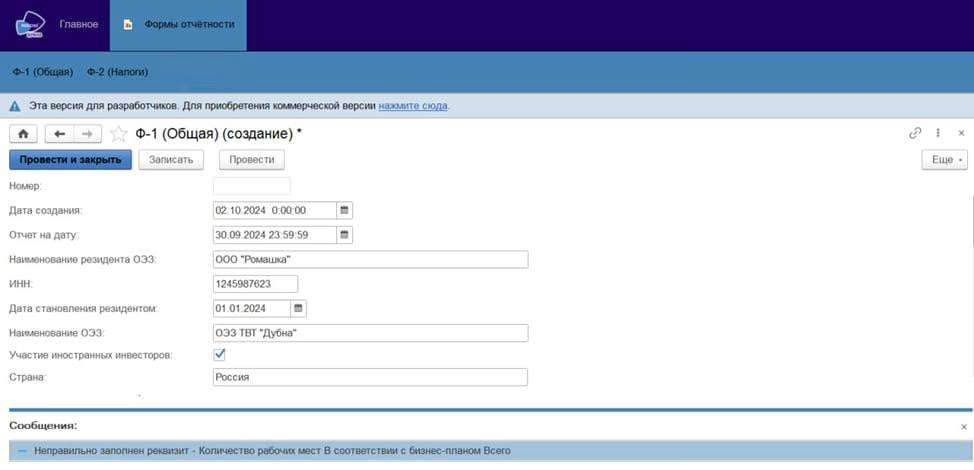
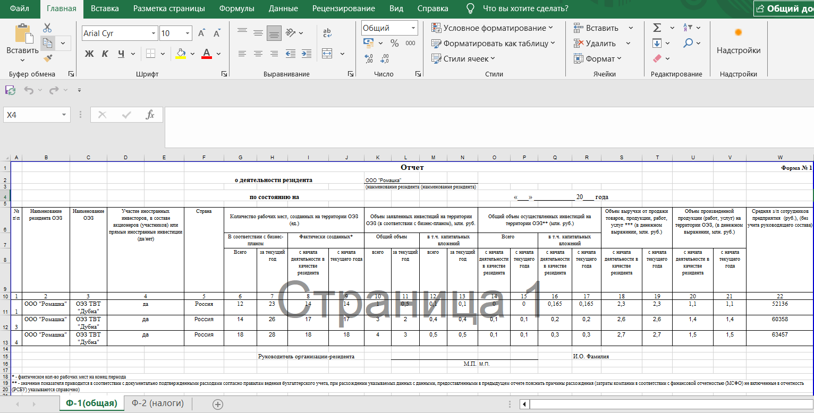
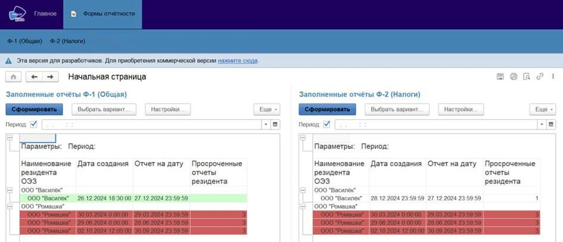
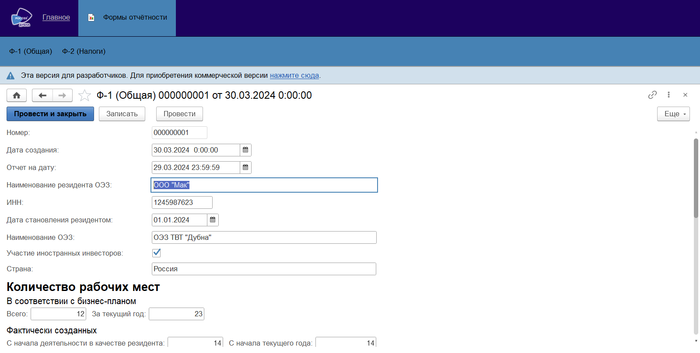

# Reporting_by_SEZ_residents
Особые экономические зоны (ОЭЗ) являются ключевым инструментом стимулирования экономического развития регионов и привлечения инвестиций, требующим постоянного мониторинга и оценки эффективности. Создание и развитие ОЭЗ направлено на формирование точек роста региональной экономики через предоставление специальных условий хозяйственной деятельности. Эффективное функционирование ОЭЗ напрямую зависит от своевременного и достоверного сбора данных отчетности от резидентов. Актуальность данной выпускной квалификационной работы обусловлена необходимостью совершенствования процесса сбора, хранения и обработки этих данных в ОЭЗ.
В рамках работы планируется разработка системы, которая позволит резидентам вводить показатели отчетности, а сотрудникам управляющей компании — отслеживать динамику данных, автоматизировать процесс верификации и формировать необходимые отчеты, включая единый ежеквартальный отчет.

## Описание процесса работы в системе 
Выполним вход в систему под пользователем «Резидент». После входа в систему будет отображена главная страница пользователя «Резидент».

Для заполнения отчёта необходимо перейти в раздел «Формы отчётности», выбрать требуемую форму: «Ф-1 (Общая)» или «Ф-2 (Налоги)». В этом разделе можно посмотреть ранее отправленные отчеты, создать новый отчет, загрузить отчет из файла Excel или выгрузить текущую отчетность в файл Excel.

 "Страница «Ф-1 (Общая)»")

Рассмотрим создание нового отчёта. Нажимаем «Создать» и заполняем данные. При нажатии на кнопку «Провести» или «Провести и закрыть» изменения будут сохранены и станут доступны для просмотра сотруднику управляющей компании, при этом редактирование станет невозможным. Если введенные данные требуют корректировки или уточнения, необходимо нажать кнопку «Записать». В этом случае данные будут сохранены, но останутся невидимыми для сотрудника управляющей компании до тех пор, пока отчёт не будет проведён. Также следует отметить, что резидент не может удалять проведённые отчёты.

В системе также реализована проверка корректности данных. Если показатели текущего квартала ниже, чем в предыдущем, документ не будет проведен. Система уведомит пользователя об ошибке и укажет на проблемный показатель.

Чтобы загрузить отчет из Excel, нажмите кнопку «Загрузить из Excel». Откроется окно, где нужно выбрать нужный файл и нажать «Открыть». Все архивные данные будут загружены из файла в систему. Это нужно для того, чтобы все данные хранились в единой системе, их было легко найти и использовать для анализа или сравнения.

Для экспорта отчётности в Excel следует нажать «Выгрузить в Excel» и указать, куда сохранить файл. Данная функция особенно важна для сотрудника управляющей компании, поскольку позволяет формировать сводную отчётность в нужном формате для предоставления в таможенные органы. Если открыть файл Excel, в который производилась выгрузка, можно убедиться в том, что все данные были выгружены корректно.

Теперь выполним вход под пользователем «Сотрудник УК». В разделе «Главное» сотрудник УК может сформировать отчёты и посмотреть резидентов, которые уже заполнили отчётность. 
Системой предусмотрена индикация резидентов, допускающих систематическую задержку в предоставлении отчетности. В случае, если резидент более трех раз предоставляет отчетность после установленного срока, он отмечается красным цветом. Данная отметка свидетельствует о возможном несоблюдении резидентом принятых обязательств и может являться основанием для рассмотрения вопроса о дальнейшем статусе резидента. Если же резидент всегда предоставляет отчётность вовремя, он отмечается зелёным цветом.

Следует отметить, что сотрудникам УК доступны аналогичные функции импорта данных из Excel (кнопка «Загрузить из Excel») и экспорта в Excel (кнопка «Выгрузить из Excel»), которые были подробно описаны ранее в контексте учетной записи «Резидент». 

")
")

Перейдя в раздел «Формы отчётности» и выбрав конкретную форму, «Ф-1 (Общая)» или «Ф-2 (Налоги)», сотрудник УК может открыть любой отчёт и скорректировать введенные в него данные.

